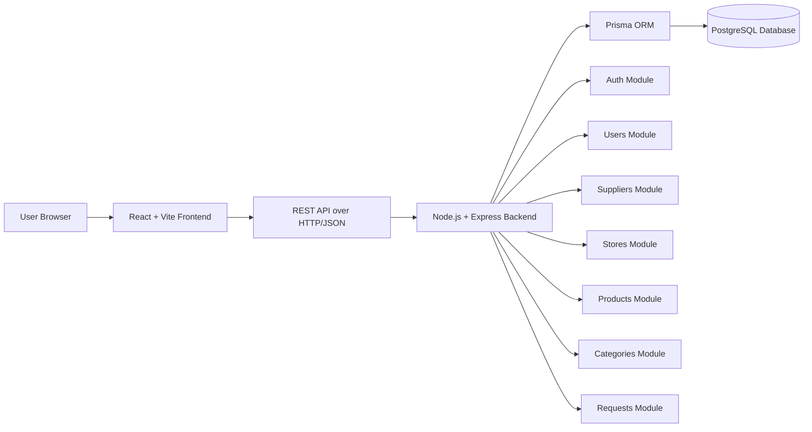
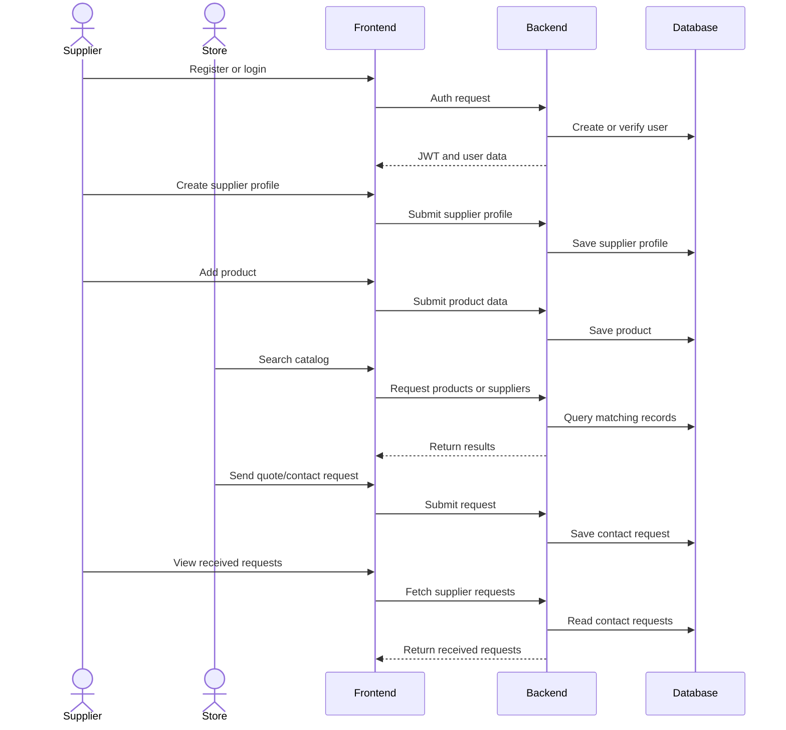

# KERNO Application Architecture

## 1. Purpose

KERNO is a B2B SaaS marketplace MVP designed to connect direct or local suppliers with retail stores.

The application focuses on a simple business flow:

1. A supplier creates an account.
2. The supplier completes a professional profile.
3. The supplier publishes products.
4. A store creates an account.
5. The store searches products or suppliers.
6. The store opens a product or supplier detail page.
7. The store sends a structured contact or quote request.
8. The supplier receives and reviews the request.

The MVP does not include payment, ordering, logistics, advanced messaging, subscriptions, or advanced analytics.

---

## 2. High-Level Architecture

KERNO uses a classic web application architecture with three main layers:

* **Frontend**: React application built with Vite.
* **Backend**: Node.js and Express REST API.
* **Database**: PostgreSQL database accessed through Prisma ORM.



---

## 3. Frontend Layer

The frontend is located in the `frontend/` directory.

It is responsible for:

* public pages such as the landing page, login and register pages;
* authenticated supplier and store dashboards;
* catalog, product detail and supplier detail pages;
* request creation and request tracking screens;
* shared UI components;
* route configuration and navigation shell;
* API calls through frontend services.

Main technologies:

* React
* JavaScript
* Vite
* CSS modules / application CSS
* React Router

The frontend does not own the business logic. It displays data, handles user interaction, validates basic UI state, and communicates with the backend API.

---

## 4. Backend Layer

The backend is located in the `backend/` directory.

It is built as a modular monolith. This means the backend is deployed as one Express application, while the source code is separated by business domains.

Main backend modules:

* `auth`
* `users`
* `suppliers`
* `stores`
* `products`
* `categories`
* `requests`
* `health`

Each module generally contains:

* a route file;
* a controller file;
* a service file;
* Swagger documentation when relevant.

The backend is responsible for:

* authentication;
* password hashing;
* JWT generation and verification;
* role-based route protection;
* supplier profile management;
* store profile management;
* product and category management;
* contact request creation and tracking;
* centralized error handling;
* OpenAPI / Swagger documentation.

---

## 5. Database Layer

The database uses PostgreSQL and Prisma ORM.

The Prisma schema is located at:

```text
backend/prisma/schema.prisma
```

The main database entities are:

* `User`
* `SupplierProfile`
* `StoreProfile`
* `Category`
* `Product`
* `ContactRequest`

Main relationships:

* one user can own one supplier profile;
* one user can own one store profile;
* one supplier can publish many products;
* one category can contain many products;
* one store can send many contact requests;
* one supplier can receive many contact requests;
* one request can optionally target a specific product.

This relational structure supports the MVP without introducing order, payment, delivery or invoicing complexity.

---

## 6. Authentication and Authorization

Authentication is handled by the backend.

The current approach uses:

* hashed passwords;
* JWT-based authentication;
* protected routes;
* role checks for supplier and store actions.

The two main user roles are:

* `SUPPLIER`
* `STORE`

Role separation is important because suppliers and stores do not have the same permissions.

Examples:

* only a supplier should create or manage supplier products;
* only a store should create contact or quote requests;
* authenticated users can access their own profile and request data.

---

## 7. API Communication

The frontend communicates with the backend through a REST API.

The backend exposes API routes under:

```text
/api
```

Swagger documentation is available through:

```text
/api/docs
```

The OpenAPI JSON document is available through:

```text
/api/openapi.json
```

API responses are JSON-based and follow a simple structure suitable for an MVP.

---

## 8. Main MVP Flow



---

## 9. Deployment Approach

The MVP is designed to support a simple deployment strategy:

* frontend deployed separately;
* backend deployed separately;
* PostgreSQL database hosted through a managed or local service depending on the environment.

The local development environment can also use Docker Compose for PostgreSQL.

---

## 10. Out of Scope for the MVP

The following features are intentionally excluded from the MVP:

* online payment;
* full order management;
* logistics and delivery tracking;
* advanced internal messaging;
* public ratings and reviews;
* advanced analytics;
* complex subscription plans;
* automated supplier scraping;
* CSV import.

These features may be considered later, but they are not required to validate the core MVP value.

---

## 11. Architecture Rationale

This architecture was chosen because it is:

* simple enough for a portfolio MVP;
* aligned with the team’s current technical stack;
* readable for technical review;
* modular enough to evolve after the MVP;
* compatible with REST API documentation;
* suitable for a marketplace workflow based on profiles, products and structured requests.

The modular monolith avoids unnecessary microservice complexity while still keeping the code organized by domain.
