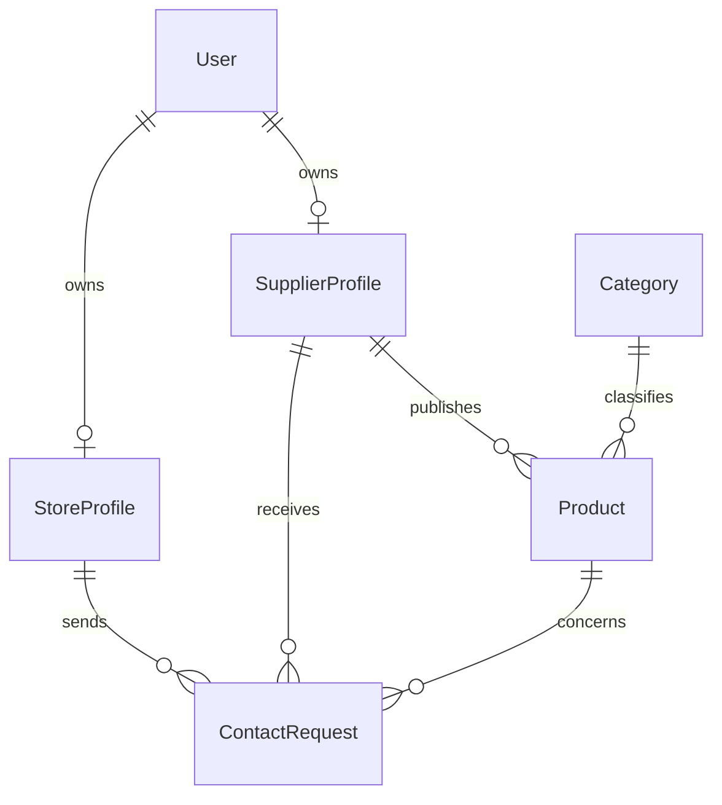

# KERNO Database Schema

## 1. Purpose

This document describes the database schema used by the KERNO MVP.

The database supports the core marketplace flow:

1. users create accounts;
2. suppliers create professional profiles;
3. suppliers publish products;
4. stores create professional profiles;
5. stores search products or suppliers;
6. stores send structured contact or quote requests;
7. suppliers review received requests.

The schema is intentionally simple and focused on the MVP scope.

---

## 2. Database Technology

KERNO uses:

* PostgreSQL as the relational database;
* Prisma ORM for schema modeling, migrations and database access.

The Prisma schema is located at:

```text
backend/prisma/schema.prisma
```

The Prisma migrations are located at:

```text
backend/prisma/migrations/
```

---

## 3. Main Entities

The MVP database contains the following main entities:

* `User`
* `SupplierProfile`
* `StoreProfile`
* `Category`
* `Product`
* `ContactRequest`

These entities match the main functional domains of the MVP: authentication, supplier profiles, store profiles, product catalog, categories and contact requests.

---

## 4. Entity Relationship Overview



---

## 5. User Model

The `User` model stores account-level information shared by all users.

### Fields

| Field          |        Type | Required | Description                      |
| -------------- | ----------: | -------: | -------------------------------- |
| `id`           | UUID string |      Yes | Unique user identifier           |
| `email`        |      String |      Yes | Unique login email               |
| `passwordHash` |      String |      Yes | Hashed password                  |
| `role`         |    UserRole |      Yes | User role: `SUPPLIER` or `STORE` |
| `firstName`    |      String |       No | User first name                  |
| `lastName`     |      String |       No | User last name                   |
| `createdAt`    |    DateTime |      Yes | Creation timestamp               |
| `updatedAt`    |    DateTime |      Yes | Last update timestamp            |

### Constraints

* `email` is unique.
* `id` is generated as a UUID.
* `role` must be either `SUPPLIER` or `STORE`.

### Relations

A user can own:

* one supplier profile;
* one store profile.

In practice, the role determines which profile type is expected.

---

## 6. UserRole Enum

The `UserRole` enum defines the two user roles supported by the MVP.

```text
SUPPLIER
STORE
```

### Role Purpose

| Role       | Purpose                                                                      |
| ---------- | ---------------------------------------------------------------------------- |
| `SUPPLIER` | Can create a supplier profile, publish products and review received requests |
| `STORE`    | Can create a store profile, browse the catalog and send contact requests     |

The role is used by the backend to protect routes and separate supplier actions from store actions.

---

## 7. SupplierProfile Model

The `SupplierProfile` model stores professional information about a supplier.

### Fields

| Field          |        Type | Required | Description                        |
| -------------- | ----------: | -------: | ---------------------------------- |
| `id`           | UUID string |      Yes | Unique supplier profile identifier |
| `userId`       | UUID string |      Yes | User owning this supplier profile  |
| `companyName`  |      String |      Yes | Supplier company name              |
| `description`  |      String |       No | Supplier description               |
| `location`     |      String |       No | City or geographic area            |
| `businessType` |      String |       No | Supplier type or activity          |
| `contactEmail` |      String |       No | Business contact email             |
| `phone`        |      String |       No | Business phone number              |
| `website`      |      String |       No | Optional website                   |
| `createdAt`    |    DateTime |      Yes | Creation timestamp                 |
| `updatedAt`    |    DateTime |      Yes | Last update timestamp              |

### Constraints

* `userId` is unique.
* A supplier profile belongs to one user.
* If the related user is deleted, the supplier profile is deleted as well.

### Relations

A supplier profile can:

* publish many products;
* receive many contact requests.

---

## 8. StoreProfile Model

The `StoreProfile` model stores professional information about a store or retail buyer.

### Fields

| Field           |        Type | Required | Description                     |
| --------------- | ----------: | -------: | ------------------------------- |
| `id`            | UUID string |      Yes | Unique store profile identifier |
| `userId`        | UUID string |      Yes | User owning this store profile  |
| `storeName`     |      String |      Yes | Store name                      |
| `brandName`     |      String |       No | Brand or retail structure       |
| `location`      |      String |       No | City or geographic area         |
| `storeType`     |      String |       No | Store type                      |
| `sourcingNeeds` |      String |       No | Main sourcing needs             |
| `contactEmail`  |      String |       No | Business contact email          |
| `phone`         |      String |       No | Business phone number           |
| `createdAt`     |    DateTime |      Yes | Creation timestamp              |
| `updatedAt`     |    DateTime |      Yes | Last update timestamp           |

### Constraints

* `userId` is unique.
* A store profile belongs to one user.
* If the related user is deleted, the store profile is deleted as well.

### Relations

A store profile can send many contact requests.

---

## 9. Category Model

The `Category` model stores product categories.

### Fields

| Field         |        Type | Required | Description                   |
| ------------- | ----------: | -------: | ----------------------------- |
| `id`          | UUID string |      Yes | Unique category identifier    |
| `name`        |      String |      Yes | Category name                 |
| `description` |      String |       No | Optional category description |
| `createdAt`   |    DateTime |      Yes | Creation timestamp            |
| `updatedAt`   |    DateTime |      Yes | Last update timestamp         |

### Constraints

* `name` is unique.

### Relations

A category can classify many products.

A product category is optional in the MVP to keep product creation flexible.

---

## 10. Product Model

The `Product` model stores products published by suppliers.

### Fields

| Field          |        Type | Required | Description                     |
| -------------- | ----------: | -------: | ------------------------------- |
| `id`           | UUID string |      Yes | Unique product identifier       |
| `supplierId`   | UUID string |      Yes | Supplier publishing the product |
| `categoryId`   | UUID string |       No | Optional product category       |
| `name`         |      String |      Yes | Product name                    |
| `description`  |      String |       No | Product description             |
| `priceCents`   |     Integer |       No | Indicative price in cents       |
| `priceUnit`    |        Enum |       No | Indicative price unit           |
| `minimumOrderQuantity` | Integer | No | Minimum order quantity |
| `minimumOrderUnit` | Enum | No | Minimum order unit |
| `origin`       |      String |       No | Origin or production area       |
| `imageUrl`     |      String |       No | Optional product image URL      |
| `isActive`     |     Boolean |      Yes | Product visibility status       |
| `createdAt`    |    DateTime |      Yes | Creation timestamp              |
| `updatedAt`    |    DateTime |      Yes | Last update timestamp           |

### Defaults

* `isActive` defaults to `true`.

### Relations

A product:

* belongs to one supplier profile;
* can belong to one category;
* can be linked to many contact requests.

### Delete Behavior

* If the supplier profile is deleted, its products are deleted.
* If the category is deleted, the product category reference is set to null.
* If a product is deleted, related contact requests keep their request history but lose the product reference.

---

## 11. ContactRequest Model

The `ContactRequest` model stores structured contact or quote requests sent by stores to suppliers.

### Fields

| Field               |        Type | Required | Description                               |
| ------------------- | ----------: | -------: | ----------------------------------------- |
| `id`                | UUID string |      Yes | Unique request identifier                 |
| `storeId`           | UUID string |      Yes | Store sending the request                 |
| `supplierId`        | UUID string |      Yes | Supplier receiving the request            |
| `productId`         | UUID string |       No | Optional product concerned by the request |
| `subject`           |      String |      Yes | Request subject                           |
| `message`           |      String |      Yes | Request message                           |
| `requestedQuantity` |      String |       No | Optional requested quantity               |
| `status`            |      String |      Yes | Simple request status                     |
| `createdAt`         |    DateTime |      Yes | Creation timestamp                        |
| `updatedAt`         |    DateTime |      Yes | Last update timestamp                     |

### Defaults

* `status` defaults to `PENDING`.

### Expected Status Values

The MVP uses simple request statuses:

```text
PENDING
READ
ANSWERED
CLOSED
```

### Relations

A contact request:

* belongs to one store profile;
* is sent to one supplier profile;
* can optionally concern one product.

### Delete Behavior

* If the store profile is deleted, its contact requests are deleted.
* If the supplier profile is deleted, its received requests are deleted.
* If the related product is deleted, `productId` is set to null.

---

## 12. Main Relationships

| Relationship                         |         Type | Description                                  |
| ------------------------------------ | -----------: | -------------------------------------------- |
| `User` → `SupplierProfile`           |       1:0..1 | A supplier user can own one supplier profile |
| `User` → `StoreProfile`              |       1:0..1 | A store user can own one store profile       |
| `SupplierProfile` → `Product`        |          1:N | A supplier can publish many products         |
| `Category` → `Product`               |          1:N | A category can classify many products        |
| `StoreProfile` → `ContactRequest`    |          1:N | A store can send many requests               |
| `SupplierProfile` → `ContactRequest` |          1:N | A supplier can receive many requests         |
| `Product` → `ContactRequest`         | 1:N optional | A request may concern a product              |

---

## 13. Physical Table Names

Prisma models are mapped to PostgreSQL tables with snake_case names.

| Prisma Model      | PostgreSQL Table    |
| ----------------- | ------------------- |
| `User`            | `users`             |
| `SupplierProfile` | `supplier_profiles` |
| `StoreProfile`    | `store_profiles`    |
| `Category`        | `categories`        |
| `Product`         | `products`          |
| `ContactRequest`  | `contact_requests`  |

Some Prisma fields are also mapped to snake_case database columns.

Examples:

| Prisma Field        | Database Column      |
| ------------------- | -------------------- |
| `passwordHash`      | `password_hash`      |
| `firstName`         | `first_name`         |
| `lastName`          | `last_name`          |
| `companyName`       | `company_name`       |
| `businessType`      | `business_type`      |
| `contactEmail`      | `contact_email`      |
| `storeName`         | `store_name`         |
| `brandName`         | `brand_name`         |
| `sourcingNeeds`     | `sourcing_needs`     |
| `priceCents`        | `price_cents`        |
| `priceUnit`         | `price_unit`         |
| `minimumOrderQuantity` | `minimum_order_quantity` |
| `minimumOrderUnit`  | `minimum_order_unit` |
| `imageUrl`          | `image_url`          |
| `isActive`          | `is_active`          |
| `requestedQuantity` | `requested_quantity` |

---

## 14. MVP Alignment

The schema supports the MVP requirements:

* user registration and authentication;
* role separation between suppliers and stores;
* supplier profile creation;
* store profile creation;
* product publication;
* category-based organization;
* catalog search support;
* product and supplier detail pages;
* structured contact or quote requests;
* supplier-side received request tracking;
* store-side sent request tracking.

---

## 15. Out of Scope

The current schema intentionally does not include:

* orders;
* payments;
* invoices;
* delivery tracking;
* carts;
* advanced messaging;
* subscriptions;
* reviews and ratings;
* advanced analytics;
* scraping-related tables.

These elements are not required for the MVP and would increase scope and complexity.

---

## 16. Design Rationale

The database schema is relational because KERNO data is strongly connected:

* users own profiles;
* suppliers publish products;
* stores send requests;
* requests connect stores, suppliers and optionally products.

PostgreSQL and Prisma provide a clear structure for these relationships while keeping the MVP simple and maintainable.

The schema is intentionally limited to the core business flow in order to support a functional and reviewable portfolio MVP.
